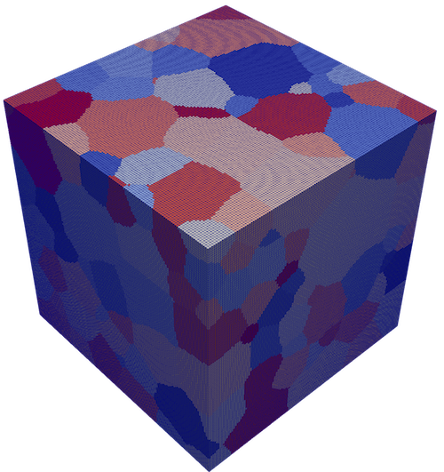
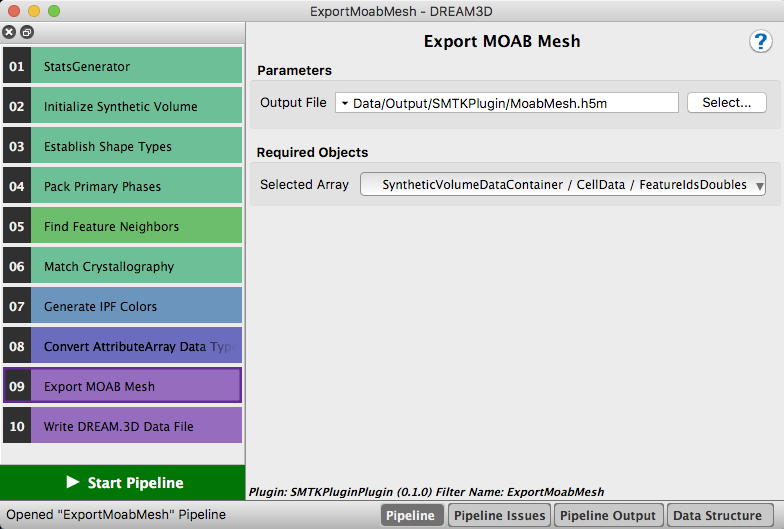

Export Moab Mesh {#exportmoabmesh}
=============

## Group (Subgroup) ##

SMTKPlugin (SMTKPlugin)

## Description ##

This **Filter** creates a mesh using MOAB from a selected attribute array and exports the mesh to either a VTK or HDF5 file. **The mesh is NOT transfered back to DREAM.3D and cannot be used in any other filter**

The filter supports the following file extensions:

VTK Files - vtk, vtu

HDF5 Files - h5m, mhdf

### Example Output ###

The following image was produced using the filter and is representative of the mesh that is written to the .h5m file.

## Parameters ##

| Name | Type | Description |
|------|------|-------------|
| Output File | QString | The path to the output file that the filter will export the mesh to. |

## Required Geometry ##

Image

## Required Objects ##

| Kind | Default Name | Type | Component Dimensions | Description |
|------|--------------|------|----------------------|-------------|
| Data Array | SelectedDataArray | double | (1) | The attribute array that MOAB will use to create the mesh. |

## Created Objects ##

None.

## License & Copyright ##

Please see the description file distributed with this plugin.

## DREAM3D Mailing Lists ##

If you need more help with a filter, please consider asking your question on the DREAM3D Users mailing list:
https://groups.google.com/forum/?hl=en#!forum/dream3d-users
